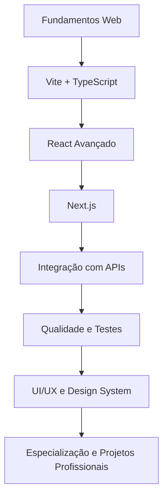

# 🗺️ Frontend Evolution V1 — Roadmap de Aprendizado

Guia de progresso e evolução contínua no **desenvolvimento front-end moderno**, estruturado para consolidar fundamentos, dominar o ecossistema **React / Vite / Next.js / TypeScript**, e evoluir até práticas profissionais.

---

## 📘 Estrutura da Trilha

| Nível | Etapa | Descrição | Status |
|:------|:------|:-----------|:-------|
| 1️⃣ | Fundamentos Web | HTML5, CSS3, JavaScript moderno (ES6+), Git e GitHub | ✅ Concluído |
| 2️⃣ | Ambiente de Desenvolvimento | Configuração com Vite e integração com React + TypeScript | 🚧 Em andamento |
| 3️⃣ | React Avançado | Componentes, Hooks, Context API, React Router, boas práticas | 🔜 Próximo |
| 4️⃣ | Next.js | SSR, SSG, rotas dinâmicas, APIs internas e deploy com Vercel | 🔜 Aguardando |
| 5️⃣ | Integração e APIs | Consumo de APIs REST, Axios, GraphQL, Firebase / Supabase | 🔜 Aguardando |
| 6️⃣ | Qualidade e Produtividade | ESLint, Prettier, Jest, React Testing Library, CI/CD | 🔜 Aguardando |
| 7️⃣ | UI/UX e Design System | Tailwind CSS, ShadCN/UI, acessibilidade (a11y), animações (Framer Motion) | 🔜 Aguardando |
| 8️⃣ | Especialização | PWA, SEO, otimizações avançadas, monorepos, mobile com React Native | 🔜 Futuro |

---

## 🔁 Fluxo de Aprendizado



---

## 📂 Organização dos Módulos

```
frontend-evolution/
│
├── 01-vite-basics/           → Fundamentos do ambiente React + Vite + TS
├── 02-react-fundamentals/    → Conceitos essenciais e hooks principais
├── 03-nextjs-intro/          → Estrutura e rotas com Next.js
├── 04-typescript-react/      → Tipagem, interfaces e boas práticas
└── ROADMAP.md                → Este guia de aprendizado
```

---

## 🧠 Habilidades-Chave em Desenvolvimento

### 🧩 Front-End Core
- HTML5 semântico  
- CSS3 responsivo (Flexbox / Grid)  
- JavaScript moderno (ES6+)  
- Versionamento com Git e GitHub  

### ⚛️ React Ecosystem
- Componentes funcionais  
- Hooks (useState, useEffect, useContext)  
- React Router  
- Context API  
- TypeScript no React  

### 🧭 Next.js Framework
- Rotas dinâmicas  
- SSR / SSG  
- API Routes  
- Deploy com Vercel  

### 🧠 Backend e Integração
- Consumo de APIs (REST / GraphQL)  
- Firebase / Supabase  
- Autenticação e persistência  

### 🧰 Ferramentas Profissionais
- ESLint + Prettier  
- Jest / Vitest / React Testing Library  
- CI/CD (GitHub Actions)  
- Docker (básico)  

### 🎨 UI/UX e Design System
- Tailwind CSS / ShadCN/UI  
- Acessibilidade (a11y)  
- Framer Motion (animações)  
- Design Responsivo e Prototipagem UX  

---

## 🧱 Próximos Marcos de Evolução

| Meta | Descrição | Progresso |
|------|------------|-----------|
| 🚀 Projeto base com Vite + React + TS | Criar app inicial e rodar ambiente local | 80% |
| ⚛️ Mini app React com Hooks e Context | Consolidar fundamentos do React | 0% |
| 🧭 Primeiro app Next.js | Criar aplicação SSR simples e publicar na Vercel | 0% |
| 🧠 Integração com API pública | Implementar consumo de dados real | 0% |
| 🧩 Aplicação final com TS + Next + Tailwind | Consolidar boas práticas e deploy final | 0% |

---

## 🌟 Missão

> “Evoluir de forma constante, sólida e aplicada — construindo conhecimento prático que se transforma em código, projetos e oportunidades reais.”  

---

## 👨‍💻 Autor

**Luciano Francisco Camargo**  
Profissional com ampla experiência em TI e foco atual em desenvolvimento **Front-end Web**, com ênfase em React, UX/UI e design responsivo.  

---

## 🌐 Conecte-se

<div align="center" style="margin-top: 25px; margin-bottom: 25px;">

  <a href="https://www.linkedin.com/in/dev-lucianocamargo">
    
  </a>
  <a href="https://github.com/KarreiraDev-LuCamargo">
    
  </a>
  <a href="mailto:lucianocamargo.lc@gmail.com">
    
  </a>
  <a href="https://wa.me/5521994629516">
    
  </a>
  <a href="tel:+5521994629516">
    
  </a>
  <a href="tel:+55213442733">
    
  </a>

</div>
  
---

**Feito com dedicação, foco e propósito — uma jornada de evolução constante no front-end moderno. 🚀**